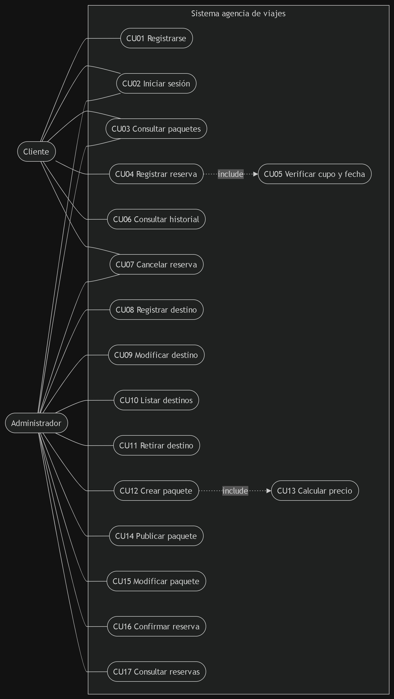
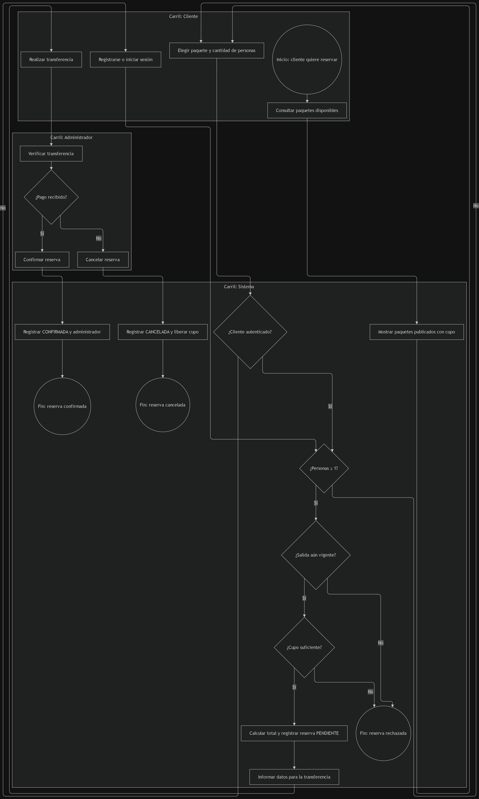
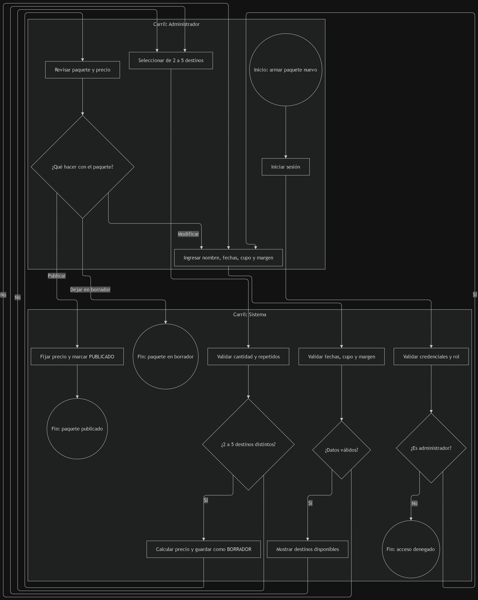
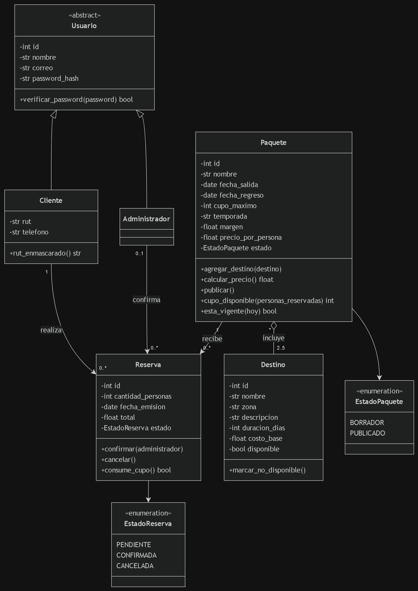
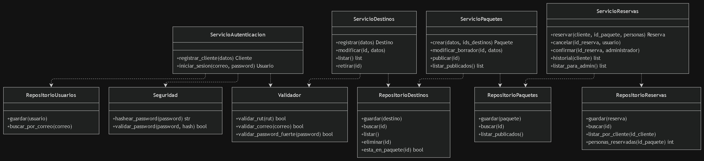

# Informe Técnico — Sistema de Agencia de Viajes "Viajes Aventura"

**Asignatura:** Programación Orientada a Objeto Seguro 
**Repositorio:** https://github.com/Natt-Stt/sistema-agencia-viajes.git


## 1. Introducción y contexto

### 1.1 Problemática

| # | Problema detectado | Evidencia del caso |
|---|---|---|
| P1 | Reservas duplicadas | 19 duplicadas al cierre |
| P2 | Cupo excedido (sobreventa) | 6 reservas por sobre el cupo |
| P3 | Ventas sobre paquetes vencidos | 3 reservas con fecha de salida pasada |
| P4 | Precio publicado distinto del cobrado | 4 paquetes, por cambio de costo de un destino |
| P5 | Destinos que ya no se operan siguen visibles | 4 de 18 destinos |
| P6 | Consulta de historial lenta y manual | 31 consultas respondidas revisando el cuaderno |
| P7 | Datos sensibles dispersos y sin protección | RUT y teléfono en planilla enviada por correo |
| P8 | Errores de cálculo manual de precio | Paquete publicado a la décima parte de su costo |

### 1.2 Objetivo

Implementar una aplicación para administrar destinos y paquetes turísticos, registrar y consultar reservas y proteger las credenciales y los datos personales de los clientes. La solución traduce las reglas del caso a validaciones de dominio, restricciones en SQLite y autorización por rol; ofrece una interfaz web con Streamlit y un menú de consola.

### 1.3 Alcance

**Fuera del alcance:** pasarela de pago, facturación electrónica, app móvil, integraciones externas, envío de correos, informes de gestión, contabilidad.


## 2. Requerimientos 

### 2.1 Requerimientos funcionales

| ID | Requerimiento | Actor | Prioridad | Origen | Criterio de aceptación |
|---|---|---|---|---|---|
| RF01 | El sistema debe permitir registrar un cliente con nombre, RUT, correo, teléfono y contraseña. | Cliente | Must | R9, R10 | Se crea la cuenta con datos válidos; un correo repetido es rechazado; la contraseña se guarda como hash. |
| RF02 | El sistema debe autenticar a clientes y administradores mediante correo y contraseña. | Cliente / Administrador | Must | R10, R11 | Credenciales correctas dan acceso según rol; incorrectas se rechazan con mensaje genérico. |
| RF03 | El sistema debe permitir registrar un destino (nombre, zona, descripción, duración, costo base). | Administrador | Must | R1, R2 | No se acepta nombre repetido ni costo ≤ 0. |
| RF04 | El sistema debe permitir modificar los datos de un destino. | Administrador | Must | R1, R2 | Los cambios se guardan y siguen cumpliendo R1 y R2. |
| RF05 | El sistema debe listar los destinos del catálogo indicando su disponibilidad. | Administrador | Must | R8 | Se muestran los destinos con su estado (disponible / no disponible). |
| RF06 | El sistema debe permitir marcar un destino como no disponible. | Administrador | Must | R8 | El destino deja de ofrecerse para paquetes nuevos y los paquetes ya vendidos conservan su contenido. |
| RF07 | El sistema debe eliminar un destino solo si no forma parte de ningún paquete. | Administrador | Must | R8 | Un destino sin paquetes se elimina; uno con paquetes no se elimina y se ofrece marcarlo no disponible. |
| RF08 | El sistema debe permitir crear un paquete con nombre, fechas, cupo, margen y de 2 a 5 destinos disponibles distintos. | Administrador | Must | R3, R4, R5, R6 | Se rechazan menos de 2 o más de 5 destinos, destinos repetidos, fecha de regreso ≤ salida, cupo ≤ 0 o margen negativo. Margen por defecto: 20 %. |
| RF09 | El sistema debe calcular el precio por persona como la suma de los costos base de los destinos más el margen. | Sistema | Must | R6 | Precio = suma(costos) × (1 + margen). Ejemplo verificable con datos del caso. |
| RF10 | El sistema debe permitir publicar un paquete, fijando su precio. | Administrador | Must | R7 | Tras publicar, un cambio de costo en un destino **no** altera el precio del paquete. |
| RF11 | El sistema debe permitir modificar un paquete mientras esté en borrador. | Administrador | Should | Supuesto S5 | Un paquete publicado no puede cambiar destinos, margen ni precio. |
| RF12 | El sistema debe mostrar los paquetes publicados con su cupo disponible. | Cliente / Administrador | Must | R14, R15 | Cupo disponible = cupo máximo − personas en reservas activas. No se muestran paquetes con salida vencida como reservables. |
| RF13 | El sistema debe permitir a un cliente autenticado registrar una reserva de un paquete. | Cliente | Must | R11–R16 | Se rechaza si personas < 1, si supera el cupo disponible o si la salida ya pasó. El total = precio × personas y queda fijo. |
| RF14 | El sistema debe permitir a un cliente consultar su historial de reservas. | Cliente | Must | R11, R17 | Solo ve sus reservas; no se muestran RUT ni teléfono. |
| RF15 | El sistema debe permitir cancelar una reserva. | Cliente / Administrador | Should | Supuesto S1 | La reserva pasa a CANCELADA y libera el cupo. |
| RF16 | El sistema debe permitir al administrador confirmar una reserva pendiente y registrar quién la confirmó. | Administrador | Should | Supuesto S2, S3 | La reserva pasa de PENDIENTE a CONFIRMADA y queda asociada al administrador. |
| RF17 | El sistema debe permitir al administrador consultar las reservas sin exponer RUT ni teléfono de los clientes. | Administrador | Should | R17 | El listado no incluye datos sensibles. |

### 2.2 Requerimientos no funcionales

| ID | Categoría | Requerimiento | Prioridad | Origen | Cómo se verifica |
|---|---|---|---|---|---|
| RNF01 | Usabilidad | El sistema ofrece un menú por consola con opciones numeradas y mensajes de error claros. | Should | Guía | Un usuario completa una reserva sin instrucciones externas. |
| RNF02 | Rendimiento | Las consultas y operaciones habituales responden en menos de 2 segundos con hasta 1.000 reservas. | Could | Caso (214 reservas/temporada) | Prueba con datos de carga. |
| RNF03 | Seguridad — credenciales | Las contraseñas se almacenan únicamente como hash con un algoritmo adaptativo (bcrypt o argon2). | Must | R10 | Revisión de la BD: ninguna contraseña legible. |
| RNF04 | Seguridad — autorización | Cada rol accede solo a sus funciones; un cliente ve únicamente sus reservas. | Must | R11 | Prueba: un cliente no accede a funciones de administrador ni a reservas ajenas. |
| RNF05 | Seguridad — datos sensibles | RUT y teléfono no aparecen en listados ni en mensajes de error. | Must | R17 | Revisión de salidas y mensajes de error. |
| RNF06 | Seguridad — entradas | Todo dato ingresado se valida y todas las consultas SQL son parametrizadas. | Must | Guía (alcance) | Pruebas con entradas maliciosas (`' OR 1=1 --`). |
| RNF07 | Integridad de datos | La BD impone restricciones (UNIQUE, CHECK, FOREIGN KEY) y las reservas se registran en una transacción. | Must | R1, R2, R9 | Intentos de insertar datos inválidos son rechazados por la BD. |
| RNF08 | Mantenibilidad | Código en capas (modelos, repositorios, servicios, seguridad), PEP 8 y docstrings. | Should | Guía | Revisión de estructura del repositorio. |
| RNF09 | Compatibilidad | Funciona con Python 3.11+ y SQLite en Windows 10/11; dependencias en `requirements.txt`. | Should | Guía | Instalación limpia en otro equipo. |

### 2.3 Reglas de negocio del caso y su traducción a requerimientos

| Regla | Resumen | Cubierta por |
|---|---|---|
| R1 | Destino con nombre, zona, descripción, duración y costo; nombre único | RF03, RF04, RNF07 |
| R2 | Costo base > 0 | RF03, RF04, RNF07 |
| R3 | Paquete de 2 a 5 destinos, sin repetir | RF08 |
| R4 | Un destino puede estar en varios paquetes | RF08 (relación N:M) |
| R5 | Paquete con nombre, fechas coherentes y cupo > 0 | RF08 |
| R6 | Precio = suma de costos + margen (20 % habitual, nunca negativo) | RF08, RF09 |
| R7 | Precio fijo al publicar | RF10 |
| R8 | Destino se elimina si no está en paquetes; si está, se marca no disponible | RF06, RF07 |
| R9 | Cliente con nombre, RUT, correo, teléfono, contraseña; correo único | RF01, RNF07 |
| R10 | Contraseña nunca en claro | RF01, RF02, RNF03 |
| R11 | Solo cliente autenticado reserva y consulta; ve solo lo suyo | RF13, RF14, RNF04 |
| R12 | Reserva = cliente + paquete + fecha + personas + total | RF13 |
| R13 | Total = precio × personas, no cambia | RF13 |
| R14 | No se acepta reserva sobre el cupo disponible | RF12, RF13 |
| R15 | No se acepta reserva con salida pasada | RF12, RF13 |
| R16 | Personas ≥ 1 | RF13 |
| R17 | RUT y teléfono no se muestran en listados ni errores | RF14, RF17, RNF05 |

### 2.4 Supuestos (vacíos del caso)

| ID | Vacío | Supuesto adoptado | Justificación técnica |
|---|---|---|---|
| S1 | ¿Qué pasa cuando un cliente desiste? | La reserva pasa a CANCELADA y libera el cupo. No se borra. | Conserva el historial (P6) y evita los cupos fantasma (P2). |
| S2 | ¿Qué estados tiene una reserva? | PENDIENTE → CONFIRMADA → CANCELADA. Pendiente y Confirmada ocupan cupo. | Refleja el proceso actual (transferencia verificada a mano) sin pasarela de pago. |
| S3 | ¿Quién confirma el pago? | Solo un administrador, tras verificar la transferencia; queda registrado quién. | La verificación automática está fuera del alcance. |
| S4 | ¿Qué pasa con un paquete cuya temporada terminó? | No se elimina; deja de ser reservable comparando con la fecha actual. | Conserva historial y cumple R15. La vigencia se calcula, no se almacena. |
| S5 | ¿Cuándo se congela el precio? (R6 "calcula" vs R7 "fijado al publicar") | El paquete nace en BORRADOR (editable) y al publicarse el precio queda fijo. | Resuelve la ambigüedad y evita P4. |
| S6 | ¿Quién modifica el catálogo? | Solo usuarios con rol Administrador. | Es el rol descrito en el caso (los tres socios). |
| S7 | ¿Cómo nace el primer administrador? | Un script de inicialización lo crea; no existe auto-registro de administradores. | Evita que cualquier persona se otorgue privilegios. |
| S8 | ¿Se permiten reservas duplicadas? | Adoptado: un cliente no puede tener dos reservas activas del mismo paquete; una cancelada no bloquea una nueva reserva. | Ataca P1 (19 duplicadas); se aplica con un índice único parcial en SQLite y una comprobación en la transacción de reserva. |
| S10 | ¿Cómo se evita revelar si existe una cuenta? | El error de login es genérico y se verifica un hash ficticio cuando no existe el correo. | Reduce la enumeración por mensaje y por diferencias de tiempo de respuesta. |
| S11 | ¿Cómo se limitan intentos fallidos de inicio de sesión? | Tras cinco fallos para una clave de correo, se bloquean nuevos intentos durante 60 segundos. | Mitiga fuerza bruta básica; el contador es local al proceso y se reinicia al reiniciar la aplicación. |


### 2.5 Verificación: ¿los requerimientos resuelven el problema?


| Problema | Requerimientos que lo resuelven |
|---|---|
| P1 Reservas duplicadas | S8, RF13 |
| P2 Cupo excedido | RF12, RF13 (R14), RNF07 |
| P3 Paquetes vencidos | RF12, RF13 (R15) |
| P4 Precio distinto del cobrado | RF10 (R7), RF13 (R13) |
| P5 Destinos no operados visibles | RF06 |
| P6 Historial manual | RF14 |
| P7 Datos sensibles sin protección | RF02, RNF03, RNF05 |
| P8 Error de cálculo manual | RF08, RF09, RNF06 |

---

## 3. Modelado 

### 3.1 Diagrama de casos de uso
   

### 3.2 Diagramas BPMN

- **BPMN 1: Proceso de reserva.**



- **BPMN 2: Creación y publicación de un paquete.**




### 3.3 Diagrama de clases 






### 3.4 Matriz de trazabilidad 

La matriz vincula cada requerimiento funcional con su regla de origen, proceso, clases, módulos y pruebas que verifican el comportamiento implementado.

| RF | Regla origen | Caso de uso | BPMN | Clase(s) | Archivo de código | Prueba |
|---|---|---|---|---|---|---|
| RF01 | R9, R10 | Registrarse como cliente | — | Cliente, ServicioAutenticacion | `src/agencia_viajes/services/servicio_autenticacion.py`, `src/agencia_viajes/validaciones.py`, `src/agencia_viajes/repositories/repositorio_usuarios.py` | `test_autenticacion.py::test_registro_valido_devuelve_cliente_con_id`; `test_seguridad.py::test_r10_el_hash_no_contiene_la_contrasena` |
| RF02 | R10, R11 | Iniciar sesión | BPMN 1 | Usuario, Cliente, Administrador, ServicioAutenticacion | `src/agencia_viajes/services/servicio_autenticacion.py`, `src/agencia_viajes/seguridad.py` | `test_autenticacion.py::test_login_correcto_devuelve_el_usuario`; `test_autenticacion.py::test_mensaje_identico_si_el_correo_no_existe_o_la_clave_es_mala` |
| RF03 | R1, R2 | Registrar destino | — | Destino, ServicioDestinos | `src/agencia_viajes/services/servicio_destinos.py`, `src/agencia_viajes/models/destino.py`, `src/agencia_viajes/repositories/repositorio_destinos.py` | `test_destinos.py::test_registrar_destino_valido_asigna_id`; `test_destinos.py::test_r2_costo_cero_o_negativo_rechazado` |
| RF04 | R1, R2 | Modificar destino | — | Destino, ServicioDestinos | `src/agencia_viajes/services/servicio_destinos.py`, `src/agencia_viajes/repositories/repositorio_destinos.py` | `test_destinos.py::test_modificar_cambia_solo_los_campos_indicados` |
| RF05 | R8 | Consultar catálogo de destinos | — | Destino, ServicioDestinos | `src/agencia_viajes/services/servicio_destinos.py`, `src/agencia_viajes/repositories/repositorio_destinos.py` | `test_destinos.py::test_listar_todos_y_solo_disponibles` |
| RF06 | R8 | Retirar o desactivar destino | — | Destino, ServicioDestinos | `src/agencia_viajes/services/servicio_destinos.py`, `src/agencia_viajes/repositories/repositorio_destinos.py` | `test_destinos.py::test_r8_destino_en_paquete_se_desactiva_y_no_se_elimina` |
| RF07 | R8 | Eliminar destino no asociado | — | Destino, ServicioDestinos | `src/agencia_viajes/services/servicio_destinos.py`, `src/agencia_viajes/repositories/repositorio_destinos.py` | `test_destinos.py::test_r8_destino_sin_paquetes_se_elimina`; `test_destinos.py::test_r8_la_base_de_datos_tambien_impide_eliminar_destino_en_paquete` |
| RF08 | R3–R6 | Crear paquete borrador | BPMN 2 | Paquete, Destino, ServicioPaquetes | `src/agencia_viajes/services/servicio_paquetes.py`, `src/agencia_viajes/models/paquete.py`, `src/agencia_viajes/repositories/repositorio_paquetes.py` | `test_paquetes_reservas.py::test_rechaza_cantidad_fechas_destinos_duplicados_y_no_disponibles` |
| RF09 | R6 | Calcular precio | BPMN 2 | Paquete | `src/agencia_viajes/models/paquete.py`, `src/agencia_viajes/services/servicio_paquetes.py` | `test_paquetes_reservas.py::test_precio_calculado_y_congelado_al_publicar` |
| RF10 | R7 | Publicar paquete | BPMN 2 | Paquete, ServicioPaquetes | `src/agencia_viajes/services/servicio_paquetes.py`, `src/agencia_viajes/repositories/repositorio_paquetes.py` | `test_paquetes_reservas.py::test_precio_calculado_y_congelado_al_publicar` |
| RF11 | S5 | Modificar paquete en borrador | — | Paquete, ServicioPaquetes | `src/agencia_viajes/services/servicio_paquetes.py` | `test_paquetes_reservas.py::test_solo_admin_crea_y_publica_y_publicado_no_se_modifica` |
| RF12 | R14, R15 | Consultar paquetes reservables y cupos | BPMN 1 | Paquete, ServicioPaquetes, ServicioReservas | `src/agencia_viajes/services/servicio_paquetes.py`, `src/agencia_viajes/repositories/repositorio_reservas.py` | `test_paquetes_reservas.py::test_reservar_calcula_total_y_actualiza_cupo`; `test_paquetes_reservas.py::test_transaccion_rechaza_sobreventa_paquete_vencido_y_duplicado_activo` |
| RF13 | R11–R16 | Registrar reserva | BPMN 1 | Reserva, ServicioReservas | `src/agencia_viajes/services/servicio_reservas.py`, `src/agencia_viajes/repositories/repositorio_reservas.py` | `test_paquetes_reservas.py::test_transaccion_rechaza_sobreventa_paquete_vencido_y_duplicado_activo` |
| RF14 | R11, R17 | Consultar historial propio | — | Reserva, ServicioReservas | `src/agencia_viajes/services/servicio_reservas.py`, `src/agencia_viajes/repositories/repositorio_reservas.py` | `test_paquetes_reservas.py::test_historial_aislado_cancelacion_libera_cupo_y_admin_confirma` |
| RF15 | S1 | Cancelar reserva | — | Reserva, ServicioReservas | `src/agencia_viajes/services/servicio_reservas.py`, `src/agencia_viajes/models/reserva.py` | `test_paquetes_reservas.py::test_historial_aislado_cancelacion_libera_cupo_y_admin_confirma` |
| RF16 | S2, S3 | Confirmar reserva pendiente | BPMN 1 | Reserva, Administrador, ServicioReservas | `src/agencia_viajes/services/servicio_reservas.py`, `src/agencia_viajes/models/reserva.py` | `test_paquetes_reservas.py::test_historial_aislado_cancelacion_libera_cupo_y_admin_confirma` |
| RF17 | R17 | Consultar reservas como administrador | — | Reserva, ServicioReservas | `src/agencia_viajes/services/servicio_reservas.py`, `src/agencia_viajes/repositories/repositorio_reservas.py` | `test_paquetes_reservas.py::test_historial_aislado_cancelacion_libera_cupo_y_admin_confirma`; `test_autenticacion.py::test_r17_resumen_y_repr_no_exponen_rut_telefono_ni_hash` |

---

## 4. Planificación ágil

### 4.1 Metodología y justificación
Se prioriza un Product Backlog reducido y demostrable: primero persistencia y catálogo; luego autenticación, paquetes y reservas; por último, estados, pruebas e informe. Los sprints de uno o dos días permiten revisar entregables con frecuencia y reordenar tareas ante bloqueos.

Cada sprint termina con una revisión funcional breve y una retrospectiva de mejoras. El repositorio permite verificar los módulos y pruebas entregados, pero no conserva actas, fechas reales de reuniones ni asignaciones nominales; por ello, el cronograma y las tareas siguientes son una reconstrucción estimada, no un registro histórico de horas.

### 4.2 Product Backlog

Las historias se priorizan según su relación con los requerimientos. La estimación usa la escala relativa de Fibonacci (1, 2, 3, 5, 8); las historias Must preceden las Should.

| ID | Historia de usuario | RF | Prioridad | Puntos | Sprint |
|---|---|---|---|---|---|
| HU01 | Como administrador, quiero registrar destinos, para armar el catálogo. | RF03 | Must | 3 | 1 |
| HU02 | Como administrador, quiero modificar, listar y retirar destinos, para mantener vigente el catálogo sin perder referencias históricas. | RF04–RF07 | Must | 5 | 1 |
| HU03 | Como cliente, quiero registrarme e iniciar sesión, para usar el sistema con una cuenta protegida. | RF01, RF02 | Must | 5 | 2 |
| HU04 | Como administrador, quiero crear un paquete con fechas, cupo, destinos y precio calculado, para ofrecer viajes consistentes. | RF08, RF09 | Must | 5 | 2 |
| HU05 | Como administrador, quiero publicar un paquete y fijar su precio, para que cambios posteriores en costos no alteren ventas existentes. | RF10 | Must | 3 | 2 |
| HU06 | Como cliente, quiero ver paquetes publicados con su cupo disponible, para elegir una alternativa reservable. | RF12 | Must | 3 | 2 |
| HU07 | Como cliente autenticado, quiero reservar un paquete, para registrar personas y el total de mi compra. | RF13 | Must | 5 | 2 |
| HU08 | Como cliente, quiero consultar mi historial, para revisar el estado y total de mis reservas. | RF14 | Must | 3 | 2 |
| HU09 | Como administrador, quiero consultar reservas y confirmar las pendientes, para registrar la verificación de pago. | RF16, RF17 | Should | 3 | 3 |
| HU10 | Como cliente o administrador, quiero cancelar una reserva, para liberar el cupo sin borrar el historial. | RF15 | Should | 3 | 3 |
| HU11 | Como administrador, quiero modificar paquetes en borrador, para corregirlos antes de publicarlos. | RF11 | Should | 3 | 3 |
| HU12 | Como usuario y responsable del sistema, quiero que credenciales, datos personales, entradas y escrituras cumplan controles de seguridad e integridad, para reducir accesos indebidos, filtraciones y datos inconsistentes. | RNF03–RNF07 | Must | 5 | 2 |

Los puntos son una estimación relativa de complejidad basada en el alcance implementado, no horas registradas.

### 4.3 Sprint Backlog y cronograma (5 días)

| Sprint | Días | Objetivo | Historias | Entregable | Responsable propuesto |
|---|---|---|---|---|---|
| 1 | 1–2 | Base del sistema: BD y destinos | HU01, HU02 | Esquema SQLite, CRUD de destinos, modelos | Desarrollo de datos y dominio; revisión cruzada |
| 2 | 3–4 | Núcleo del negocio y seguridad | HU03–HU08, HU12 | Registro/login, hash, cifrado, paquetes y reservas con reglas | Desarrollo de servicios y seguridad; revisión cruzada |
| 3 | 5 | Cierre y calidad | HU09–HU11 | Funciones Should, pruebas de regresión e informe | Integración, pruebas y documentación |

**Tareas estimadas por sprint (bloques de 1–4 horas):**

- **Sprint 1:** definir y probar el esquema y las restricciones (3 h, datos); implementar modelos y validaciones de Destino (3 h, dominio); crear repositorio y servicios CRUD (4 h, backend); probar unicidad, modificación y retiro (3 h, pruebas).
- **Sprint 2:** implementar registro, validación y autenticación (4 h, seguridad); integrar bcrypt y cifrado de datos personales (3 h, seguridad); construir paquetes, cálculo y publicación del precio (4 h, dominio/backend); implementar reservas, cupos, historial y transacciones (4 h, backend); probar autorizaciones y reglas críticas (4 h, pruebas).
- **Sprint 3:** completar confirmación, cancelación y edición de borradores (4 h, backend); ejecutar y corregir pruebas integradas (3 h, pruebas); verificar interfaces e instrucciones de ejecución (2 h, integración); cerrar trazabilidad e informe (3 h, documentación).


---

## 5. Implementación 

### 5.1 Arquitectura y estructura del proyecto
```text
sistema-agencia-viajes/
├── app.py                         Interfaz web Streamlit
├── src/agencia_viajes/
│   ├── models/                     Entidades y reglas locales de dominio
│   ├── repositories/               Consultas SQL y persistencia SQLite
│   ├── services/                   Casos de uso y reglas de negocio/autorización
│   ├── database.py                 Conexión y DDL del esquema
│   ├── seguridad.py                Hash bcrypt y cifrado Fernet
│   ├── validaciones.py              Normalización y validación de entradas
│   ├── autorizacion.py              Comprobación de roles
│   ├── errores.py                   Excepciones controladas
│   ├── crear_admin.py               Alta inicial de administradores
│   └── main.py                      Interfaz de consola
├── tests/                           Pruebas automatizadas unittest
├── docs/                            Informe, material de referencia e imágenes
├── data/                            Base SQLite y clave local ignorada por Git
├── .streamlit/                      Configuración de Streamlit
└── requirements.txt                 Dependencias externas
```

La separación hace que los modelos apliquen invariantes del dominio, los servicios coordinen casos de uso y permisos, y los repositorios traduzcan operaciones a SQL. La seguridad y la conexión se mantienen en módulos propios, mientras las interfaces (consola y web) consumen los mismos servicios. Así, cambiar la interfaz no obliga a duplicar reglas de negocio ni SQL.

### 5.2 Persistencia de datos
**Motor:** SQLite (módulo `sqlite3` de la librería estándar). Se eligió porque el sistema es local y de alcance acotado, no requiere instalar ni administrar un servidor de base de datos y ofrece transacciones, índices y restricciones relacionales. El módulo estándar reduce dependencias; las reservas usan una transacción `BEGIN IMMEDIATE` para serializar la comprobación de cupo y la escritura.

**Tablas implementadas:** `usuarios`, `destinos`, `paquetes`, `paquete_destino` y `reservas`. El DDL completo y ejecutable está centralizado en `src/agencia_viajes/database.py` (`ESQUEMA`), y se crea con `crear_esquema()`. Entre las restricciones están `UNIQUE` con comparación sin distinción de mayúsculas para el correo y nombre de destino; `CHECK` para rol, costo, duración, fechas, cupo, margen, estado y cantidad de personas; y claves foráneas con política de borrado adecuada. La tabla puente tiene clave primaria compuesta para impedir repetir el mismo destino en un paquete. Un índice único parcial impide más de una reserva activa por cliente y paquete.

```sql
CREATE TABLE IF NOT EXISTS usuarios (
    id INTEGER PRIMARY KEY AUTOINCREMENT,
    nombre TEXT NOT NULL,
    correo TEXT NOT NULL UNIQUE COLLATE NOCASE,
    password_hash TEXT NOT NULL,
    rol TEXT NOT NULL CHECK (rol IN ('CLIENTE', 'ADMINISTRADOR')),
    rut TEXT,
    telefono TEXT,
    CHECK (rol = 'ADMINISTRADOR' OR (rut IS NOT NULL AND telefono IS NOT NULL))
);

CREATE TABLE IF NOT EXISTS destinos (
    id INTEGER PRIMARY KEY AUTOINCREMENT,
    nombre TEXT NOT NULL UNIQUE COLLATE NOCASE,
    zona TEXT NOT NULL,
    descripcion TEXT NOT NULL DEFAULT '',
    duracion_dias INTEGER NOT NULL CHECK (duracion_dias > 0),
    costo_base INTEGER NOT NULL CHECK (costo_base > 0),
    disponible INTEGER NOT NULL DEFAULT 1 CHECK (disponible IN (0, 1))
);

CREATE TABLE IF NOT EXISTS paquetes (
    id INTEGER PRIMARY KEY AUTOINCREMENT,
    nombre TEXT NOT NULL,
    fecha_salida TEXT NOT NULL,
    fecha_regreso TEXT NOT NULL,
    cupo_maximo INTEGER NOT NULL CHECK (cupo_maximo > 0),
    temporada TEXT NOT NULL DEFAULT '',
    margen REAL NOT NULL DEFAULT 0.20 CHECK (margen >= 0),
    precio_por_persona INTEGER NOT NULL CHECK (precio_por_persona > 0),
    estado TEXT NOT NULL DEFAULT 'BORRADOR'
        CHECK (estado IN ('BORRADOR', 'PUBLICADO')),
    CHECK (fecha_regreso > fecha_salida)
);

CREATE TABLE IF NOT EXISTS paquete_destino (
    id_paquete INTEGER NOT NULL REFERENCES paquetes(id) ON DELETE CASCADE,
    id_destino INTEGER NOT NULL REFERENCES destinos(id) ON DELETE RESTRICT,
    PRIMARY KEY (id_paquete, id_destino)
);

CREATE TABLE IF NOT EXISTS reservas (
    id INTEGER PRIMARY KEY AUTOINCREMENT,
    id_cliente INTEGER NOT NULL REFERENCES usuarios(id),
    id_paquete INTEGER NOT NULL REFERENCES paquetes(id),
    cantidad_personas INTEGER NOT NULL CHECK (cantidad_personas >= 1),
    fecha_emision TEXT NOT NULL,
    total INTEGER NOT NULL CHECK (total > 0),
    estado TEXT NOT NULL DEFAULT 'PENDIENTE'
        CHECK (estado IN ('PENDIENTE', 'CONFIRMADA', 'CANCELADA')),
    id_confirmado_por INTEGER REFERENCES usuarios(id)
);

CREATE UNIQUE INDEX IF NOT EXISTS uq_reserva_activa_cliente_paquete
ON reservas (id_cliente, id_paquete)
WHERE estado IN ('PENDIENTE', 'CONFIRMADA');
```

```text
usuarios 1 ─── N reservas N ─── 1 paquetes
paquetes 1 ─── N paquete_destino N ─── 1 destinos
usuarios (administrador) 1 ─── N reservas.confirmada_por
```

`paquete_destino` es necesaria porque un paquete puede incluir varios destinos y un destino puede estar en varios paquetes (relación N:M). Sus claves foráneas impiden referencias inexistentes y `ON DELETE RESTRICT` protege destinos que ya pertenecen a paquetes; los destinos asociados se desactivan en vez de borrarse.

### 5.3 Operaciones CRUD implementadas

| Entidad | Create | Read | Update | Delete |
|---|---|---|---|---|
| Destino | Implementado | Implementado | Implementado; validado | Implementado solo si no tiene paquetes; si tiene, se desactiva |
| Paquete | Implementado como borrador | Implementado | Implementado solo en borrador | No implementado; se conserva para proteger el historial |
| Reserva | Implementado como pendiente | Historial del cliente y listado administrador | Confirmar/cancelar mediante transición de estado | Cancelación lógica; no se borra el registro |

### 5.4 Principios de POO aplicados 

| Principio | Dónde se aplica en el código | Por qué |
|---|---|---|
| Abstracción | `models/usuario.py`: `Usuario` hereda de `ABC` y declara `rol` y `resumen` abstractos. | Define el contrato común de identidad sin permitir instanciar un usuario sin rol concreto. |
| Herencia | `models/cliente.py` y `models/administrador.py` heredan de `Usuario`. | Reutiliza correo, nombre y verificación de contraseña, manteniendo los datos y funciones propios de cada rol. |
| Polimorfismo | `rol` y `resumen()` se implementan de forma distinta en `Cliente` y `Administrador`; autenticación devuelve `Usuario`. | Los servicios e interfaces pueden trabajar con el tipo base y obtener el comportamiento correspondiente al rol real. |
| Encapsulamiento | Propiedades con almacenamiento interno (`_nombre`, `_correo`, `_costo_base`, etc.) y setters validadores en los modelos. | Impide que cambios realizados fuera de la creación inicial dejen entidades con datos inválidos; hash y atributos internos sensibles no se exponen en representaciones. |

### 5.5 Instrucciones de instalación y ejecución
```bash
git clone https://github.com/Natt-Stt/sistema-agencia-viajes.git
cd sistema-agencia-viajes
python -m venv .venv
.venv\Scripts\Activate.ps1
pip install -r requirements.txt
python -m src.agencia_viajes.main
```

La interfaz web se inicia con `streamlit run app.py`. Se requiere Python 3.11 o posterior. En el primer uso, el esquema y la clave de cifrado local se inicializan automáticamente al iniciar la aplicación. **Administrador inicial:** ejecutar `python -m src.agencia_viajes.crear_admin` desde la raíz y seguir las preguntas de nombre, correo y contraseña; no hay autorregistro de administradores.

---

## 6. Seguridad 

### 6.1 Autenticación
Las contraseñas se procesan con `bcrypt` (dependencia PyPI), usando un costo de 12 rondas en ejecución normal y una sal aleatoria nueva incorporada al hash. Durante el registro se exige una contraseña de al menos 8 caracteres, con mayúscula, minúscula y número; se rechazan más de 72 bytes UTF-8, límite de bcrypt. En el inicio de sesión, `bcrypt.checkpw` compara la entrada con el hash guardado sin recuperar la contraseña original. No se usa SHA-256 ni MD5 para contraseñas: son funciones rápidas de propósito general que permiten probar candidatos con mucha rapidez; bcrypt es adaptativo y eleva deliberadamente el costo de cada intento. Las pruebas reducen el costo de bcrypt a 4 para ejecutarse más rápido; esa configuración es exclusiva del entorno de pruebas.

### 6.2 Validación de credenciales y entradas
El correo se recorta, se normaliza a minúsculas y se valida por formato y longitud máxima de 254 caracteres; la base también impone unicidad sin distinguir mayúsculas. El RUT chileno se normaliza y valida con dígito verificador módulo 11. El teléfono acepta de 8 a 15 dígitos con `+` opcional. Los nombres y campos de dominio rechazan tipos, formatos o rangos inválidos; la contraseña sigue la política indicada arriba.

El inicio de sesión entrega el mismo mensaje («Credenciales inválidas.») si el correo no existe, está mal formado o la contraseña es incorrecta. Para reducir la enumeración por tiempo se verifica un hash ficticio cuando no se encuentra la cuenta. Se bloquea temporalmente la clave de correo después de cinco fallos durante 60 segundos. Todas las consultas SQL que reciben valores usan parámetros `?`; en la consulta `IN` de destinos solo se construye dinámicamente la cantidad de marcadores, y los identificadores se pasan como parámetros.

### 6.3 Protección de datos sensibles
La contraseña se almacena como hash bcrypt, no en texto claro. RUT y teléfono se cifran con Fernet antes de persistirse y solo se descifran al reconstruir el objeto cliente; las interfaces muestran ambos parcialmente enmascarados y los listados de reservas no los incluyen. Los mensajes controlados de validación y negocio no repiten las entradas; `repr` y `resumen` del usuario omiten datos personales y hash.

La clave se lee prioritariamente de la variable de entorno `AGENCIA_CLAVE_CIFRADO`; si no está definida, se lee o crea `data/clave.key`, que está excluida por `.gitignore`. No existe un `.env` requerido. La pérdida de esa clave impide recuperar RUT y teléfono cifrados. La base `data/agencia.db` sí está versionada en el repositorio, por lo que no debe contener datos personales reales: debe retirarse del control de versiones o sustituirse por una base de prueba anonimizada antes de distribuir datos de producción.

### 6.4 Evaluación de seguridad con apoyo de IA 


| Amenaza | Riesgo en este sistema | Recomendación de IA | Mi validación técnica | Mejora aplicada |
|---|---|---|---|---|
| Inyección SQL | Una entrada manipulada podría alterar consultas de autenticación o persistencia. | Usar consultas parametrizadas y probar entradas de inyección en límites públicos. | Repositorios y servicios pasan valores con `?`; la prueba de login con `' OR 1=1 --` no autentica y existe prueba de texto SQL en nombre de destino. | Consultas parametrizadas y pruebas de regresión presentes; mantenerlas en nuevas consultas. |
| Fuerza bruta en login | Intentos repetidos podrían descubrir una contraseña débil. | Limitar intentos y comprobar tanto la cuenta existente como inexistente. | Hay bloqueo tras 5 fallos por 60 segundos y prueba con reloj falso. El contador es solo memoria del proceso: se reinicia al reiniciar y no coordina instancias. | Bloqueo temporal existente. Para despliegue multiinstancia, persistir/compartir límites y considerar señales por IP; no implementado. |
| Acceso a funciones de otro rol | Un cliente podría invocar operaciones administrativas desde una interfaz distinta. | Verificar permisos en los servicios, no solo ocultar controles de interfaz. | `exigir_administrador`/`exigir_cliente` se invocan desde servicios; pruebas rechazan acciones de cliente y reservas ajenas. | Autorización en capa de servicio implementada y probada. |
| Fuga de RUT/teléfono en errores | Excepciones, listados o representaciones podrían divulgar datos personales. | Evitar incluir entradas en errores y limitar campos devueltos en listados y `repr`. | Se validan mensajes sin eco de RUT/teléfono, `repr` y `resumen` omiten los datos; listados de reservas solo proyectan campos operativos. | Validaciones genéricas, enmascaramiento y cifrado Fernet ya implementados; mantener pruebas específicas. |
| Secretos en el repositorio | Una clave o una base con datos reales versionada expondría información. | Excluir claves y bases de datos locales; revisar también lo que ya está en el índice Git. | `data/clave.key` está ignorada, pero `git ls-files` confirma que `data/agencia.db` sí está versionada. No se inspeccionó la base. | Clave ignorada. Pendiente: confirmar que la BD versionada sea solo de prueba; si no, retirar la BD mutable del índice y sustituirla por fixture anonimizada. |

---

## 7. Uso crítico de herramientas de IA 


| # | Fecha | Herramienta | Qué pedí | Qué sugirió | Cómo lo validé | Decisión (usado / modificado / descartado) y por qué | Integrante |
|---|---|---|---|---|---|---|---|
| 1 | No consta | Claude | Revisión del análisis de requerimientos y modelo de clases | Detectó contradicciones con las reglas del caso (RN02 vs R3, RN04 vs R8), sugirió herencia `Usuario` y separar servicios | Según el registro descrito en el borrador, se contrastaron los puntos con el caso; la estructura final se comprobó en modelos, servicios y repositorios. | Modificado: se refleja la estructura de capas y la jerarquía `Usuario` existente; se debe conservar la decisión de negocio que el equipo haya validado con el caso. El repositorio no permite reconstruir quién hizo esta revisión ni su fecha. | No consignado |
| 2 | 04-10-2026 | Copilot (asistente IA en VS Code) | Completar los apartados pendientes del informe basándose en la implementación. | Contrastar requisitos con módulos y pruebas, completar trazabilidad, arquitectura, seguridad, operación y resultados, y distinguir controles presentes de mejoras pendientes. | Revisé los archivos fuente, las pruebas y el índice Git; ejecuté `python -m unittest discover -s tests -v` (73 pruebas). | Modificado: documenté solo comportamientos contrastados con código/pruebas y señalé como estimaciones o pendientes los datos que no podían probarse; no cambié el código de aplicación. | No consignado |

---

## 8. Pruebas

La tabla resume pruebas automatizadas seleccionadas para las reglas de negocio y seguridad. La suite completa se ejecutó con `unittest`; no se adjuntan capturas.

Ejecución: `python -m unittest discover -s tests -v`, Python 3.13.16, 73 pruebas, resultado global `OK`. Las pruebas se implementan con `unittest`; en los módulos de autenticación y seguridad se reduce el costo bcrypt a 4 solo durante la ejecución de tests (producción usa 12).

| Prueba | Regla | Entrada | Resultado esperado | Resultado obtenido |
|---|---|---|---|---|
| Reserva sobre el cupo | R14 | Cupo 3; una reserva ocupa 1; otro cliente intenta reservar 3 | Rechazada, sin exceder el cupo | OK: `test_transaccion_rechaza_sobreventa_paquete_vencido_y_duplicado_activo` |
| Reserva con salida vencida | R15 | Paquete con salida anterior a la fecha simulada | Rechazada | OK: `test_transaccion_rechaza_sobreventa_paquete_vencido_y_duplicado_activo` |
| Precio congelado | R7 | Publicar paquete y luego subir costo de un destino | Precio publicado no cambia | OK: `test_precio_calculado_y_congelado_al_publicar` |
| Correo duplicado | R9 | Registrar dos veces el mismo correo, variando mayúsculas | Segundo registro rechazado | OK: `test_r9_correo_duplicado_rechazado_sin_importar_mayusculas` |
| Contraseña en BD | R10 | Leer `password_hash` después del registro | No contiene contraseña; es hash bcrypt | OK: `test_r10_la_contrasena_se_guarda_como_hash` y `test_r10_el_hash_no_contiene_la_contrasena` |
| Costo cero | R2 | Crear un destino con costo 0 | Rechazado | OK: `test_r2_costo_cero_o_negativo_rechazado`; también se verifica `CHECK` de BD con SQL directo |
| Paquete con 1 o 6 destinos | R3 | Crear con 1; intentar lista de 6 destinos (con repetidos) | Ambos rechazados | OK: `test_rechaza_cantidad_fechas_destinos_duplicados_y_no_disponibles` |
| Datos sensibles en error | R17 | Ingresar RUT/teléfono inválido y revisar mensajes, resumen y `repr` | El error no repite los datos; salidas no muestran RUT/teléfono completos | OK: `test_r17_mensaje_de_error_no_repite_el_rut`, `test_telefono_invalido_rechazado_y_sin_eco`, `test_r17_resumen_y_repr_no_exponen_rut_telefono_ni_hash` |

---

## 9. Conclusiones

La aplicación implementa un flujo conectado de registro/autenticación, catálogo de destinos, construcción y publicación de paquetes y gestión de reservas. Las reglas del dominio y restricciones de SQLite atacan los problemas de sobreventa, fechas vencidas, cálculo y congelamiento de precios, destinos que dejaron de ofrecerse y reservas activas duplicadas. Los clientes pueden consultar solo su historial; las contraseñas se guardan con bcrypt y RUT/teléfono se cifran con Fernet. Las pruebas automatizadas cubren estas reglas y las 73 ejecutadas en esta revisión finalizaron correctamente.

Quedan fuera los pagos, la facturación, las integraciones y notificaciones externas y el análisis de gestión, de acuerdo con el alcance. Para una siguiente versión conviene retirar la base mutable del repositorio y usar fixtures de prueba, gestionar la clave de cifrado en un almacén externo en despliegues reales, persistir el bloqueo de login si hay varios procesos, medir rendimiento con datos de carga y documentar responsables, reuniones y decisiones reales del equipo.

---

## Referencias

- Sánchez Palacio, A. (2025). *ChatGPT y OpenAI: desarrollo y uso de herramientas de inteligencia artificial generativa.* RA-MA Editorial.
- Jiménez de Parga, C. (2021). *UML: arquitectura de aplicaciones en Java, C++ y Python* (1.ª ed.). Ra-Ma.
- Cuevas Álvarez, A. (2016). *Python 3.* RA-MA Editorial.
- Python Software Foundation. *Documentación de Python 3: sqlite3*. https://docs.python.org/3/library/sqlite3.html
- PyPI. *bcrypt*. https://pypi.org/project/bcrypt/
- The Python Cryptographic Authority. *Fernet (symmetric encryption)*. https://cryptography.io/en/latest/fernet/
- OWASP Foundation. *Password Storage Cheat Sheet*. https://cheatsheetseries.owasp.org/cheatsheets/Password_Storage_Cheat_Sheet.html
- OWASP Foundation. *SQL Injection Prevention Cheat Sheet*. https://cheatsheetseries.owasp.org/cheatsheets/SQL_Injection_Prevention_Cheat_Sheet.html
